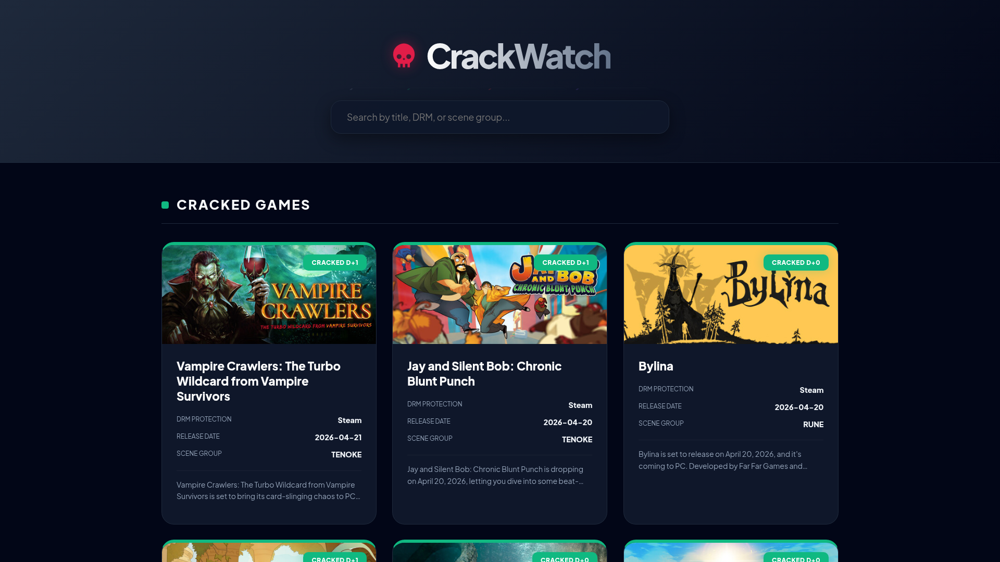
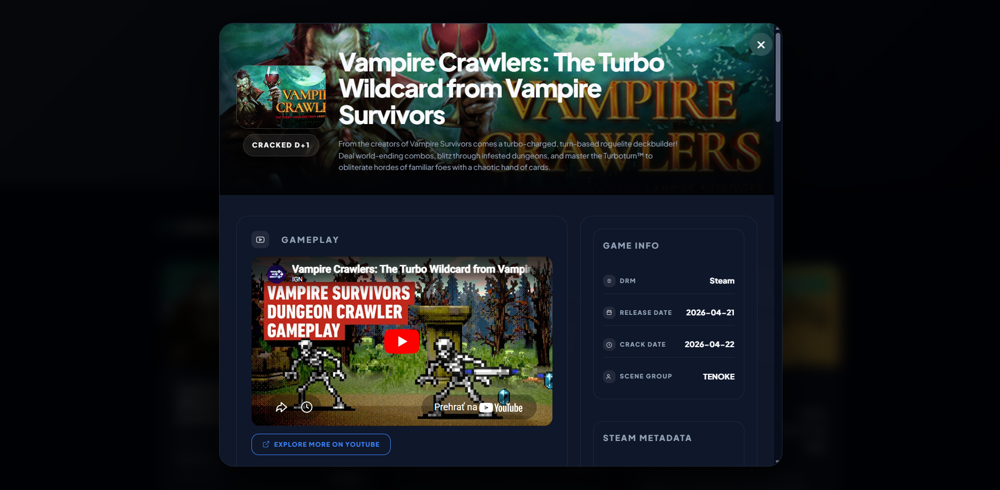

#  CrackWatch

CrackWatch is a web application designed to track the crack status of PC games. It provides real-time information on whether a game is cracked, its DRM protection, scene group details, and upcoming releases. The app integrates with Steam and YouTube to provide comprehensive game metadata and gameplay previews.

## Table of Contents
- [Features and Usage](#features-and-usage)
- [Instructions](#instructions)
- [Technical Specifications](#technical-specifications)
- [Live Demo](#live-demo)
- [Screenshots](#screenshots)
- [Support & Feedback](#support--feedback)
- [Disclaimer](#disclaimer)
- [License](#license)

## Features and Usage
* **Real-time Tracking:** Monitor the status of cracked, uncracked, and upcoming games.
* **Search & Filter:** Quickly find games by title, DRM protection (e.g., Denuvo), or scene group.
* **Steam Integration:** Automatically fetches game descriptions, system requirements, genres, and pricing from the Steam Store.
* **Gameplay Previews:** Integrated YouTube player to watch gameplay trailers directly within the app.

## Instructions
**Local Development:**
- Clone the repository.
- Install dependencies: `pip install -r requirements.txt`.
- Set up your `YOUTUBE_API_KEY` in environment variables.
- Run the app: `python app.py`.

## Technical Specifications

| Category | Details |
| :--- | :--- |
| **Backend** | Python 3.12 (Flask Framework) |
| **Frontend** | Vanilla JavaScript, CSS3 (Modern UI), HTML5 |
| **Database** | Supabase (PostgreSQL) |
| **APIs** | Steam Store API, YouTube Data API v3 |

### Under the Hood
The application uses a dynamic backend to process game data from Supabase and enriches it with real-time data from external providers. It calculates "D+X" days for cracked games and "D-X" countdowns for upcoming releases to provide clear status insights.

## Live Demo
Experience the live version of the application here:
**[dkajan9-crackwatch.hf.space](https://dkajan9-crackwatch.hf.space)**

## Screenshots

  
<b>Main Page</b>

  

  
<b>Modal Dialog</b>

  

## Support & Feedback
If you encounter any bugs, have questions, or want to suggest new features, please **[open an issue](../../issues)**. Your feedback is highly appreciated!

## Disclaimer
This project is for informational purposes only. It does not host, provide, or link to any illegal content, pirated software, or cracked files. All game data and images are fetched via public APIs for metadata display purposes.

## License
This project is licensed under the **MIT License**. See the **[LICENSE](./LICENSE)** file for full details.

